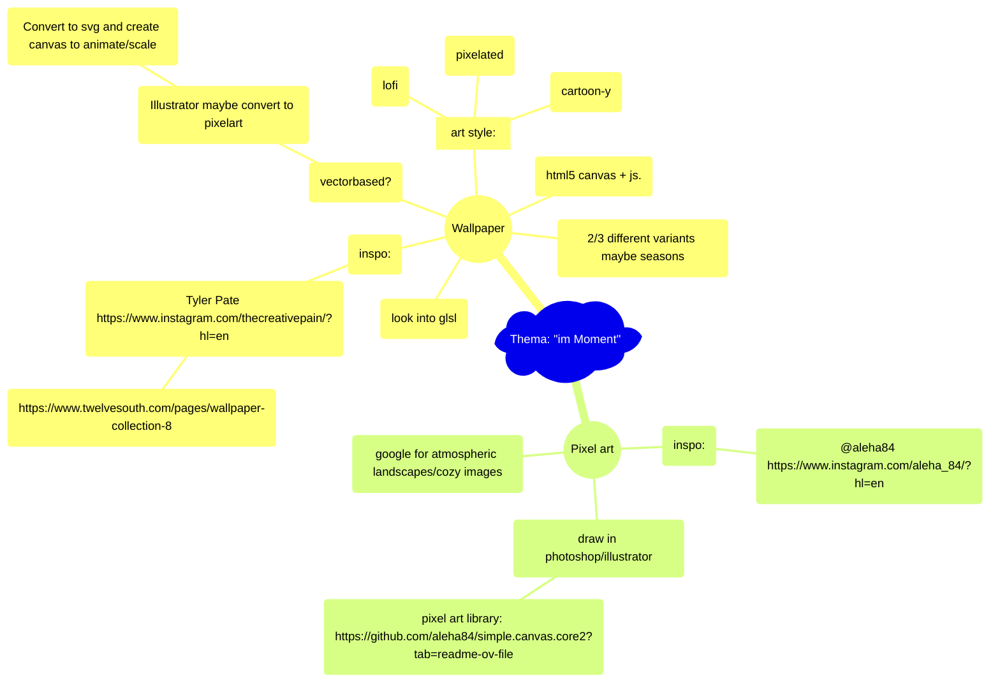

# Hausaufgabe Interaction Design ZHdK, Thema: "im-Moment"

## Meditative and animated landscapes

### To-Do:
- [ ] Test html5 canvas

```mermaid
mindmap
    )Thema: "im Moment"(

        ((Wallpaper))
        
            (inspo:)
                (Tyler Pate https://www.instagram.com/thecreativepain/?hl=en)
                    (https://www.twelvesouth.com/pages/wallpaper-collection-8)

            (vectorbased?)
                (Illustrator maybe convert to pixelart)
                    (Convert to svg and create canvas to animate/scale)

            [art style:] 
                (cartoon-y)
                (pixelated)
                ("lofi")

            (2/3 different variants maybe seasons)

            (look into glsl)

            (html5 canvas + js.)

        ((Pixel art))

            (inspo:)
                (@aleha84 https://www.instagram.com/aleha_84/?hl=en)

            (draw in photoshop/illustrator)
                (pixel art library: https://github.com/aleha84/simple.canvas.core2?tab=readme-ov-file)

            (google for atmospheric landscapes/cozy images)


```