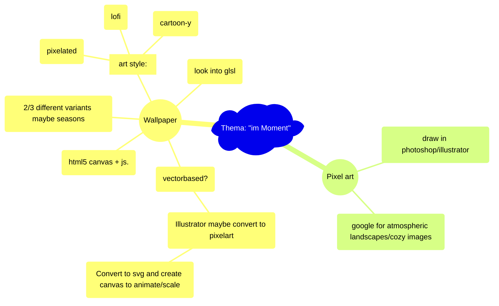

# Hausaufgabe Interaction Design ZHdK, Thema: "im-Moment"

## Description/general idea:

peaceful atmospheric images/environment to get a break from a busy day, to relax with, to get lost in, and to tune out. 

## To-Do:

### <ins>Ideas:</ins>

#### IMPORTANT:
  - [ ] figure out how to make every canvas the same size, and then scale based on that?
  - [ ] implement something to keep the browser from crashing in case i fuck something up

#### Fade effect
  - [ ] speed up clouds etc to the side?
  - [ ] Also fade in plane/stars etc when toggle

#### Birds flying by
  - [ ]sequence of maybe 6 frames/images of flapping wings, repeating? 

#### Smoking chimneys
  - [ ] Fix speed/pixelated value

#### Night sky --> draw stars
  - [x] Make stars move --> either rotate or just move horizontally
  - [x] Make stars "flicker" etc

  - [x] Stars not scaling/resizing properly yet

#### Night sky 2 ---> northern lights?
  - [ ] northern lights:
    - [ ] https://codepen.io/jhereg00/pen/JKbQyR
    - [ ] https://github.com/Btsan/Aurora-Effect/tree/master

#### rain --> draw clouds
  - [ ] Various levels of opacity, overlaying
  - [ ] Parallax clouds

#### Evening --> draw airplane with trail
  - [ ] make scale properly
  - [ ] make trail dissapear after a while

#### Rest
- [ ] figure out pixelate filter --> for rain
  (You don't need to iterate pixel buffer to create a pixelating effect.
  Simply turn off image smoothing and enlarge a small version of the image to the canvas. This will also mean you can use any image as source (CORS-wise).

  // get a block size (see demo for this approach)
  var size = blocks.value / 100,
      w = canvas.width * size,
      h = canvas.height * size;

  // draw the original image at a fraction of the final size
  ctx.drawImage(img, 0, 0, w, h);

  // turn off image aliasing
  ctx.msImageSmoothingEnabled = false;
  ctx.mozImageSmoothingEnabled = false;
  ctx.webkitImageSmoothingEnabled = false;
  ctx.imageSmoothingEnabled = false;

  // enlarge the minimized image to full size    
  ctx.drawImage(canvas, 0, 0, w, h, 0, 0, canvas.width, canvas.height);)

- [ ] Foreground of window?
- [ ] unpixelated images --> photoshop out windows

### <ins>Infrastructure:</ins>

- [ ] look into luminesce masks
- [ ] Sort files into canvas/effects and scenes (with both)
- [ ] some pixel color movement
- [ ] Figure out how to make it centered on screen
- [ ] Figure out how to host from github?
- [ ] figure out how to render on my nextjs page?
- [ ] slider to fade between?
- [ ] Research workflow --> look into https://github.com/aleha84/simple.canvas.core2?tab=readme-ov-file
- [ ] Figure out a good project structure

### <ins>Completed:</ins>
- [x] Fade, fixed
- [x] Figure out how to make it fill screen (resizing up and down)
- [x] Add buttons/toggles for all 5 images
- [x] Move rain to different file?
- [x] Fade between images -> maybe make two canvases?
- [x] smoke not working at all
- [x] Set "default" size for smoke canvas --> something like 1500px by 1500px, and then scale based on that
  - test 2000 or 2500 or 3000 px
  - test not square aspect ratio (1:2)
- [x] Figure out testing buttons (rain/smoke etc on second row)

### Ideas for images:

- [ ] Night --> northern lights, stars
- [ ] Half night --> smoking chimneys
- [ ] Clouds --> rain (or snow) --> check out lightinggenerator
- [ ] Day --> small clouds, airplanes (?)

- [x] Different times of day (day/night)
- [ ] Different weather (rain/cloudy/sunny etc)

- [x] Smoking chimneys
- [x] Rain
- [ ] Snow?
- [ ] aurora borealis 
- [ ] Liminal spaces

### <ins>Illustrator/Photoshop:</ins>
- [ ] Pixel value: 6
- [ ] png for layers
- [ ] svg to canvas converter

### <ins>HTML5 Canvas:</ins>
- [x] Test html5 canvas

### <ins>Mind-Map:</ins>

