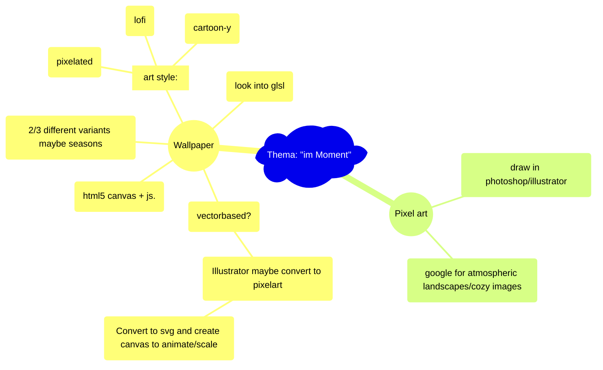

# Hausaufgabe Interaction Design ZHdK, Thema: "im-Moment"

https://flokleiser.github.io/im-Moment/

## Description/general idea:

peaceful atmospheric images/environment to get a break from a busy day, to relax with, to get lost in, and to tune out. 

### Ideas
Night --> northern lights, stars
Half night --> smoking chimneys
Clouds --> rain (or snow) --> check out lightinggenerator
Day --> small clouds, airplanes (?)
Movement --> planes, birds

Different times of day (day/night)
Different weather (rain/cloudy/sunny etc)

### <ins>Mind-Map:</ins>

