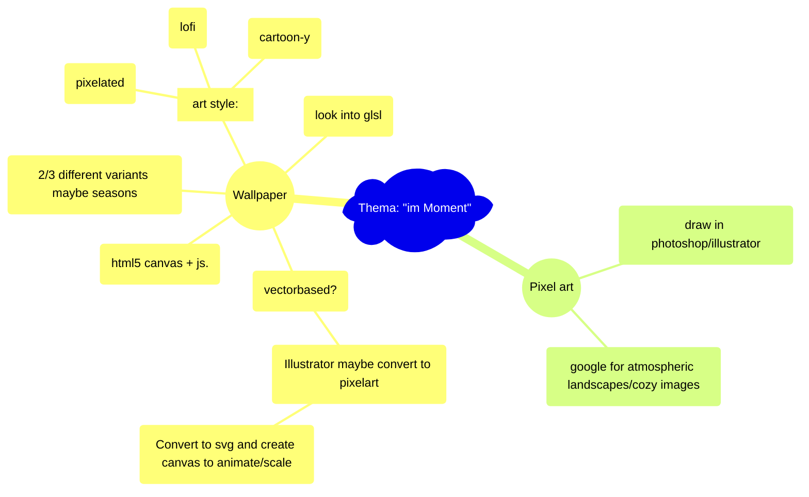

# Interaction Design ZHdK,   Thema: "im-Moment"

### https://flokleiser.github.io/Momentfulness/

___

### Projektbeschrieb Momentfulness

<!-- [[projektbeschrieb]] -->

___

## Description/general idea:

peaceful atmospheric images/environment to get a break from a busy day, to relax with, to get lost in, and to tune out. 

___

### General to do:

- [ ] Rethink buttons (big, in the middle)

#### Audio
- [ ] soundscapes collection
    - [x] Rain:
        - [x] Cars Rain
        - [x] Rain
        - [x] Ambulance

        - [x] ambient sound that loops: rain

    - [ ] Day:
        - [x] Birds
        - [ ] Cars 
        - [ ] Footsteps
        - [x] People chatter

        - [x] ambient sound that loops: birds & chatter

    - [ ] Evening:
        - [x] Church bells
        - [ ] People chatter

        - [ ] one ambient sound that loops: bells? 

    - [ ] Night:
        - [ ] Cricket(?)
        - [ ] Maybe some ambient music to underlay?

        - [ ] one ambient sound that loops: night 

    - [ ] Global button to enable/disable all sound

#### Visual:
- [ ] Finish all the details
    - [ ] maybe smaller birds
    - [ ] Maybe shooting stars
    - [ ] Fix plane trails?
    - [x] Change chimney smoke color

#### End product
- [ ] Tie everything together
    - [ ] Figure out timings on automatic switching
    - [ ] Figure out when title
    - [ ] Center canvas

### Ideas/Brainstorming

 

- Night --> northern lights, stars, maybe a galaxy, moon, **shooting stars**
- Half night --> smoking chimneys, moon
- Clouds --> rain (or snow), maybe something to indicate wind? --> fade in rain
- Day --> small clouds, airplanes , planes, birds, **smaller birds**

___

### Features:

- Different times of day (day/dusk/night)
- Different weather (rain/cloudy/sunny etc)
- Different sounds (Birds, tourists, wind, rain, cars, church bells)

___

### <ins>Mind-Map:</ins>

