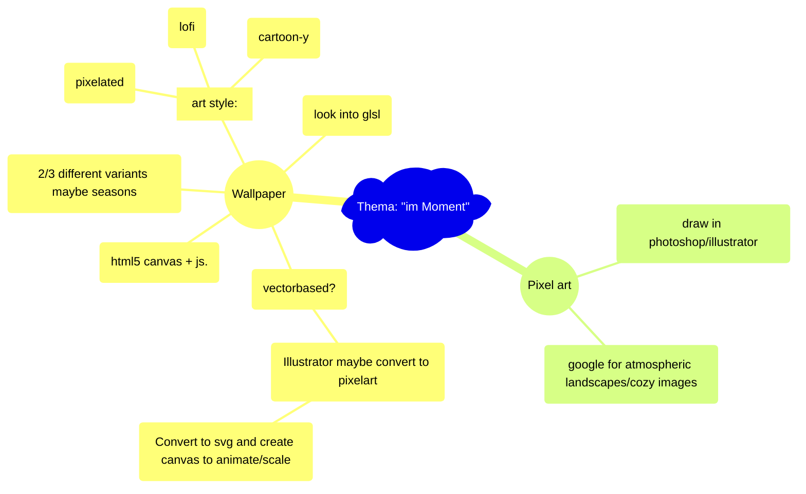

# Hausaufgabe Interaction Design ZHdK, Thema: "im-Moment"

## Description/general idea:

peaceful atmospheric images/environment to get a break from a busy day, to relax with, to get lost in, and to tune out. 

## To-Do:

### <ins>Ideas:</ins>

#### IMPORTANT:
  - [ ] figure out how to make every canvas the same size, and then scale based on that?
  - [ ] implement something to keep the browser from crashing in case i fuck something up

#### Fade effect
  - [ ] speed up clouds etc to the side?
  - [ ] Also fade in plane/stars etc when toggle

#### BIRDS
- [ ] Idlebird --> animate back into idle position

  - [ ] Figure out how to create instances (of birds)
  - [x] Reference material
  - [ ] Sprites (at least 2 or 3 versions to reuse)
    - [ ] Flying bird
    - [ ] Sitting bird
  - [ ] sequence of maybe 6 frames/images of flapping wings, repeating? 

#### Smoking chimneys
  - [ ] Fix speed/pixelated value

#### Stars
  - [ ] Add comets/shooting stars?
  - [x] Make stars move --> either rotate or just move horizontally
  - [x] Make stars "flicker" etc

  - [x] Stars not scaling/resizing properly yet

#### Northern lights?
  - [ ] northern lights:
    - [ ] https://codepen.io/jhereg00/pen/JKbQyR
    - [ ] https://github.com/Btsan/Aurora-Effect/tree/master

#### Rain/Clouds
  - [ ] Various levels of opacity, overlaying
  - [ ] Parallax clouds
    - [ ] https://codepen.io/vavik96/pen/vEdMXM
    - [ ] https://codepen.io/jackrugile/pen/nmexZj

#### Airplane with trail
  - [ ] make scale properly
  - [ ] make trail dissapear after a while
    - [ ] Look into globalCompositeOperation

#### Rest
- [ ] figure out pixelate filter --> for rain
- [ ] Foreground of window?
- [ ] unpixelated images --> photoshop out windows

### <ins>Infrastructure:</ins>

- [ ] look into luminesce masks
- [ ] Sort files into canvas/effects and scenes (with both)
- [ ] some pixel color movement
- [ ] Figure out how to make it centered on screen
- [ ] Figure out how to host from github?
- [ ] figure out how to render on my nextjs page?
- [ ] Research workflow --> look into https://github.com/aleha84/simple.canvas.core2?tab=readme-ov-file
- [ ] Figure out a good project structure

### <ins>Completed:</ins>
- [x] Fade, fixed
- [x] Figure out how to make it fill screen (resizing up and down)
- [x] Add buttons/toggles for all 5 images
- [x] Move rain to different file?
- [x] Fade between images -> maybe make two canvases?
- [x] smoke not working at all
- [x] Set "default" size for smoke canvas --> something like 1500px by 1500px, and then scale based on that
  - test 2000 or 2500 or 3000 px
  - test not square aspect ratio (1:2)
- [x] Figure out testing buttons (rain/smoke etc on second row)

### Ideas for images:

Night --> northern lights, stars
Half night --> smoking chimneys
Clouds --> rain (or snow) --> check out lightinggenerator
Day --> small clouds, airplanes (?)
Movement --> planes, birds

Different times of day (day/night)
Different weather (rain/cloudy/sunny etc)

### <ins>Mind-Map:</ins>

