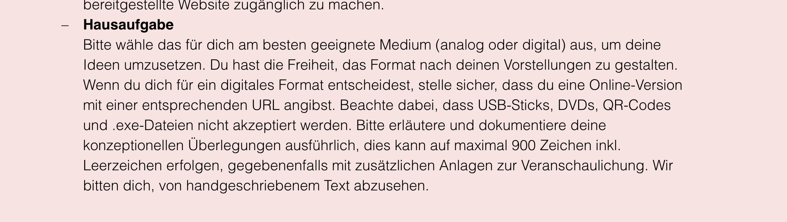
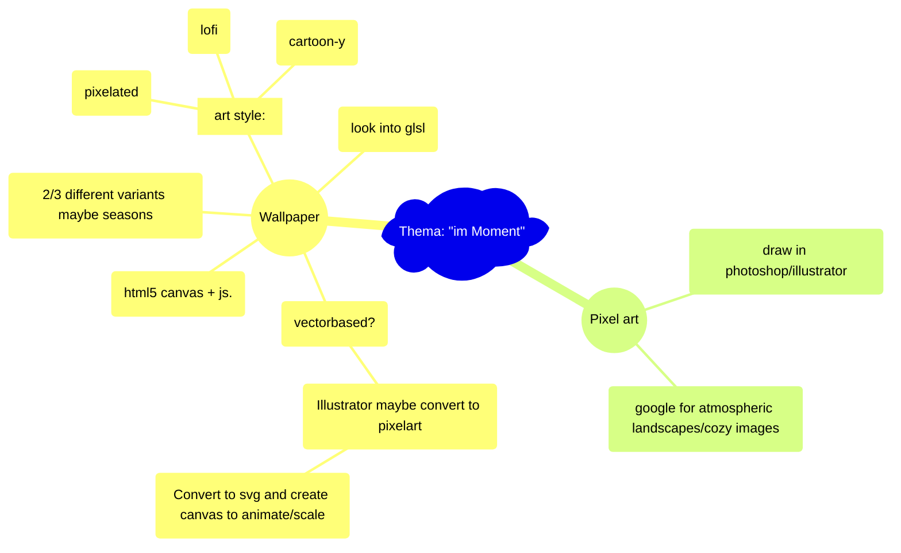

# Interaction Design ZHdK,   Thema: "im-Moment"

### https://flokleiser.github.io/im-Moment/

___

### Projektbeschrieb

[[projektbeschrieb]]

___

## Description/general idea:

peaceful atmospheric images/environment to get a break from a busy day, to relax with, to get lost in, and to tune out. 

___

### Ideas/Brainstorming
- Night --> northern lights, stars, maybe a galaxy
- Half night --> smoking chimneys, 
- Clouds --> rain (or snow), maybe something to indicate wind? ------> if rain, make picture darker
- Day --> small clouds, airplanes , planes, birds, smaller birds

 

- Soundscapes --> button to toggle sound on/off

___

### Features:

- Different times of day (day/dusk/night)
- Different weather (rain/cloudy/sunny etc)
- Different sounds (Birds, tourists, wind, rain, cars, church bells)

___

### <ins>Mind-Map:</ins>

