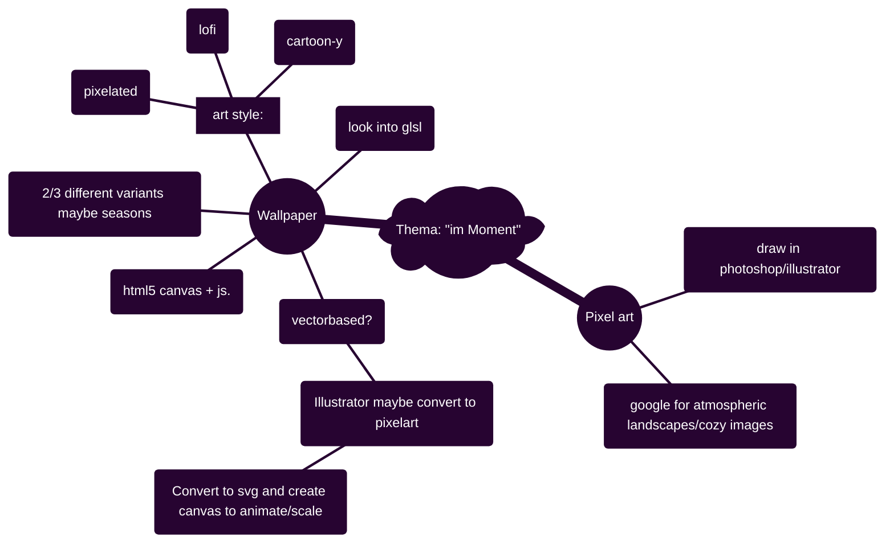

# Hausaufgabe Interaction Design ZHdK, Thema: "im-Moment"

## Description/general idea:

peaceful atmospheric images/environment to get a break from a busy day, to relax with, to get lost in, and to tune out. 

## To-Do:

### <ins>Ideas:</ins>
- [ ] unpixelated images --> photoshop out windows
- [ ] night sky --> draw stars
- [ ] rain --> draw clouds
- [ ] evening --> draw airplane with trail
- [ ] figure out pixelate filter --> for rain
- [ ] Parallax clouds

### <ins>Infrastructure:</ins>
- [ ] Figure out how to make it centered on screen
- [ ] Figure out how to host from github?
- [ ] figure out how to render on my nextjs page?

- [ ] slider to fade between?

- [ ] Research workflow --> look into https://github.com/aleha84/simple.canvas.core2?tab=readme-ov-file
- [ ] Figure out a good project structure

### <ins>Completed:</ins>
- [x] Figure out how to make it fill screen (resizing up and down)
- [x] Add buttons/toggles for all 5 images
- [x] Move rain to different file?
- [x] Fade between images -> maybe make two canvases?

### Ideas for images:

- [ ] Night --> northern lights, stars
- [ ] Half night --> smoking chimneys
- [ ] Clouds --> rain (or snow) --> check out lightinggenerator
- [ ] Day --> small clouds, airplanes (?)

- [ ] Different times of day (day/night)
- [ ] Different weather (rain/cloudy/sunny etc)

- [ ] Smoking chimneys
- [ ] Rain
- [ ] Snow?
- [ ] aurora borealis 
- [ ] Liminal spaces

### <ins>Illustrator/Photoshop:</ins>
- [ ] Pixel value: 6
- [ ] png for layers
- [ ] svg to canvas converter

### <ins>HTML5 Canvas:</ins>
- [ ] Test html5 canvas

### <ins>Mind-Map:</ins>

