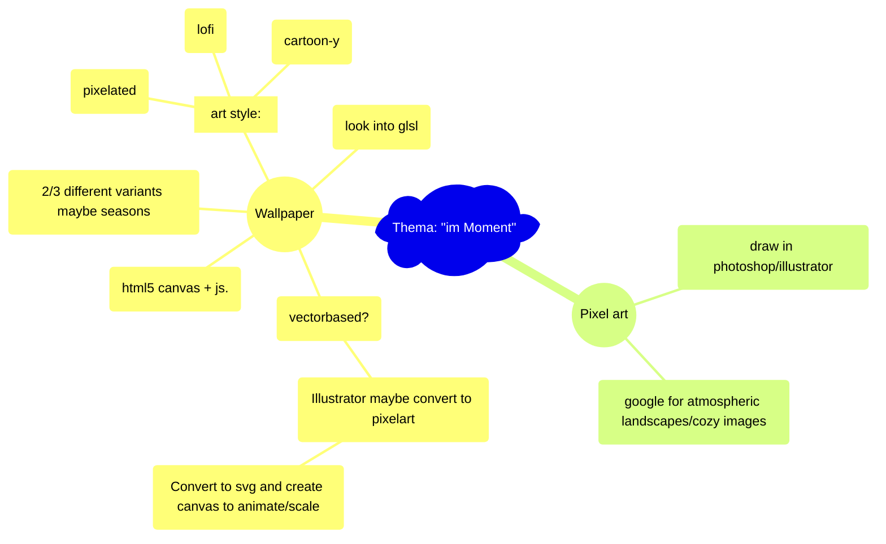

# Interaction Design ZHdK,   Thema: "im-Moment"

### https://flokleiser.github.io/Momentfulness/

___

## Description/general idea:

peaceful atmospheric images/environment to get a break from a busy day, to relax with, to get lost in, and to tune out. 

___

### General to do:

#### Audio

- [ ] Global button to enable/disable all sound
- [ ] "reset sound" button?

- [ ] soundscapes collection
    - [x] Rain:
        - [x] Cars Rain
        - [x] Rain
        - [x] Ambulance
        - [x] ambient sound that loops: rain

    - [ ] Day:
        - [x] Birds
        - [ ] **Cars**
        - [ ] **Footsteps**
        - [x] People chatter
        - [x] ambient sound that loops: birds & chatter

    - [ ] Evening:
        - [x] Church bells
        - [x] Remove fade out bells
        - [ ] **People chatter**
        - [x] one ambient sound that loops: bells? 

    - [ ] Night:
        - [ ] **Cricket(?)**
        - [ ] **Maybe some ambient music to underlay?**
        - [ ] **one ambient sound that loops: night**

#### Visual:

- [ ] Title
    - [ ] Better title image
        - [ ] description of "click a button"
        - [ ] Maybe short overview?
        - [ ] Hover tool tips?
    
- [ ] Finish all the details
    - [x] maybe smaller birds
    - [x] Maybe shooting stars
    - [x] Fix plane trails?
    - [x] toggle borealis automatically
    - [x] Change chimney smoke color

    - [ ] Fade outs:
        - [ ] Plane trails
        - [x] Fade out smoke 

    - [ ] Repeats
        - [ ] Bird idle
        - [ ] Windows

#### End product
- [ ] Tie everything together

    - [ ] Not done yet:
        - [ ] Figure out looping of functions
        - [ ] Center canvas

        - [ ] Loop birds day
        - [ ] loop windows evening
        - [ ] Maybe loop borealis
        - [ ] Better night airplanes
        - [ ] Loop night airplanes

    - [ ] Done:
        - [x] Figure out timings on automatic switching
        - [x] Figure out when title
        - [x] Rain 
        - [x] Loop rain 
        - [x] Loop clouds
        - [x] Day
        - [x] Loop airplanes
        - [x] Loop Smoke chimneys
        - [x] Occasionally turn on borealis

### Ideas/Brainstorming

 

- Night --> northern lights, stars, maybe a galaxy, moon, **shooting stars**
- Half night --> smoking chimneys, moon
- Clouds --> rain (or snow), maybe something to indicate wind? --> fade in rain
- Day --> small clouds, airplanes , planes, birds, **smaller birds**

___

### Features:

- Different times of day (day/dusk/night)
- Different weather (rain/cloudy/sunny etc)
- Different sounds (Birds, tourists, wind, rain, cars, church bells)

___

### <ins>Mind-Map:</ins>

