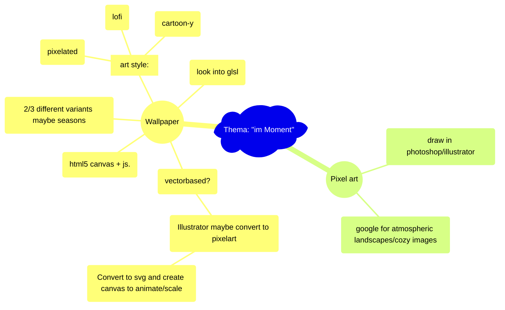

# Hausaufgabe Interaction Design ZHdK, Thema: "im-Moment"

## Description/general idea:
peaceful atmospheric images/environment to get a break from a busy day, to relax with, to get lost in, and to tune out. 

### To-Do:

#### HTML5 Canvas:
- [ ] Test html5 canvas

#### Illustrator:
- [ ] Test path --> svg --> --> html5 canvas conversion tools

#### General:
- [ ] Research workflow --> look into https://github.com/aleha84/simple.canvas.core2?tab=readme-ov-file
- [ ] Figure out a good project structure

