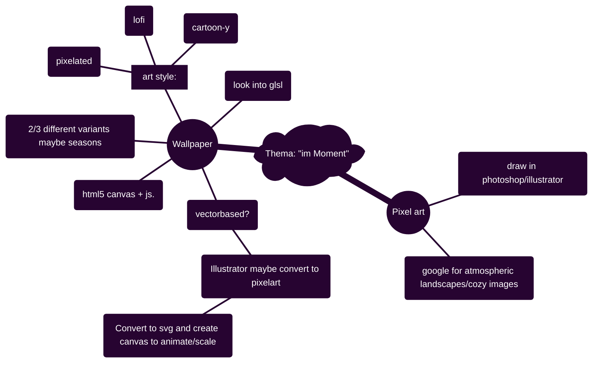

# Hausaufgabe Interaction Design ZHdK, Thema: "im-Moment"

## Description/general idea:

peaceful atmospheric images/environment to get a break from a busy day, to relax with, to get lost in, and to tune out. 

## To-Do:

[[How-To (for me)]]

### <ins>General:</ins>
- [ ] Research workflow --> look into https://github.com/aleha84/simple.canvas.core2?tab=readme-ov-file
- [ ] Figure out a good project structure

### Ideas for images:
- [ ] Liminal spaces
- [ ] Rain/Snow?
- [ ] test

### <ins>Illustrator:</ins>
- [ ] png for layers
- [ ] svg to canvas converter

### <ins>HTML5 Canvas:</ins>
- [ ] Test html5 canvas

### <ins>Mind-Map:</ins>

