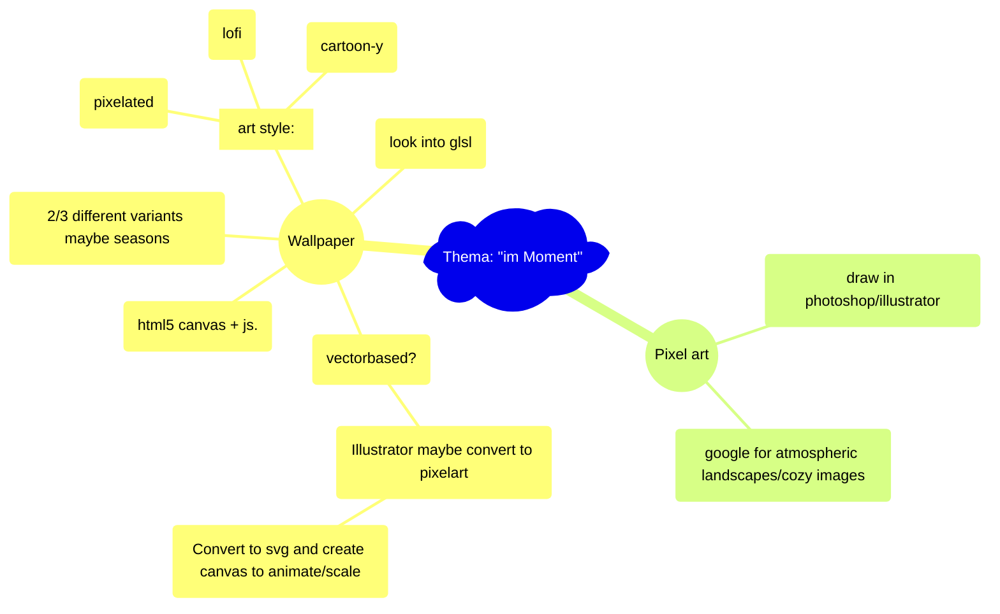

# Hausaufgabe Interaction Design ZHdK,   Thema: "im-Moment"

https://flokleiser.github.io/im-Moment/

## Description/general idea:

peaceful atmospheric images/environment to get a break from a busy day, to relax with, to get lost in, and to tune out. 

### Ideas/Brainstorming
- Night --> northern lights, stars, maybe a galaxy
- Half night --> smoking chimneys, 
- Clouds --> rain (or snow), maybe something to indicate wind?
- Day --> small clouds, airplanes (?)
- Movement --> planes, birds, smaller birds

- Maybe soundscapes
- Different times of day (day/night)
- Different weather (rain/cloudy/sunny etc)

debug tool --> coordinates from mouse onclick

### <ins>Mind-Map:</ins>

