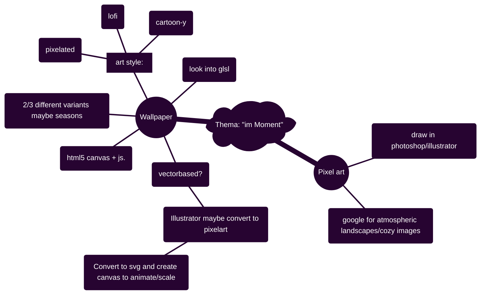

# Hausaufgabe Interaction Design ZHdK, Thema: "im-Moment"

## Description/general idea:

peaceful atmospheric images/environment to get a break from a busy day, to relax with, to get lost in, and to tune out. 

## To-Do:

### <ins>Illustrator:</ins>

- [ ] List of things i can do that can be rendered on a html canvas
    - svg
    - pixel art
    - 
- [ ] Test path --> svg --> --> html5 canvas conversion tools

### <ins>HTML5 Canvas:</ins>

- [ ] Test html5 canvas

### <ins>General:</ins>

- [ ] Research workflow --> look into https://github.com/aleha84/simple.canvas.core2?tab=readme-ov-file
- [ ] Figure out a good project structure

### <ins>Mind-Map:</ins>

- [ ] Figure out how to change colors in mermaid

