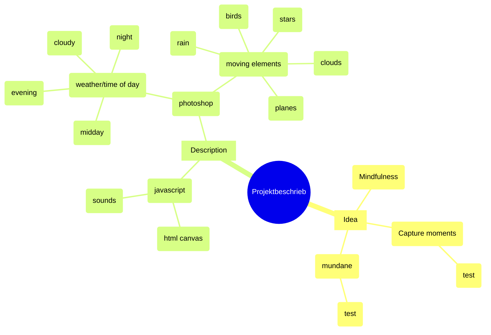

#### V 1.5 (idea)

My idea for this project was to recreate moments of mindfulness, a topic that is very important in my daily life. 
When i feel stressed or overwhelmed, i often look out of my window and try to focus on the scenery, the details, the sounds, 
and the whole picture, and i wanted to try and capture some of these moments.

___

#### V 1.5 (specifics/technical details)

The project constists of four images of the cityscape opposite my house, that i took over the span of a day. 
These images were then edited and pixelated using Photoshop, and rendered on a html canvas. 

Afterwards i drew additional elements like birds, clouds and raindrops, to enhance the original images and add some movement and life. 
These elements were overlayed and animated using JavaScript and html. 
In addition, i recorded different ambient sounds to more accurately recreate these „momentary snapshots“. The end result can be viewed here:

___

#### V 1.5 (full)

My idea for this project was to recreate moments of mindfulness, a topic that 
is very important in my daily life. When i feel stressed or overwhelmed, i often look out of my window and try to focus on the scenery, the details, the sounds, and the whole picture, and i wanted to try and capture some of these moments.

The project constists of four images of the cityscape opposite my house, that i took over the span of a day. These images were then edited and pixelated using Photoshop, and rendered on a html canvas. 

Afterwards i drew additional elements like birds, clouds and raindrops, to 
enhance the original images and add some movement and life. These elements were overlayed and animated using JavaScript and html. In addition, i recorded different ambient sounds to more accurately recreate these „momentary 
snapshots“. The end result can be viewed here:

___