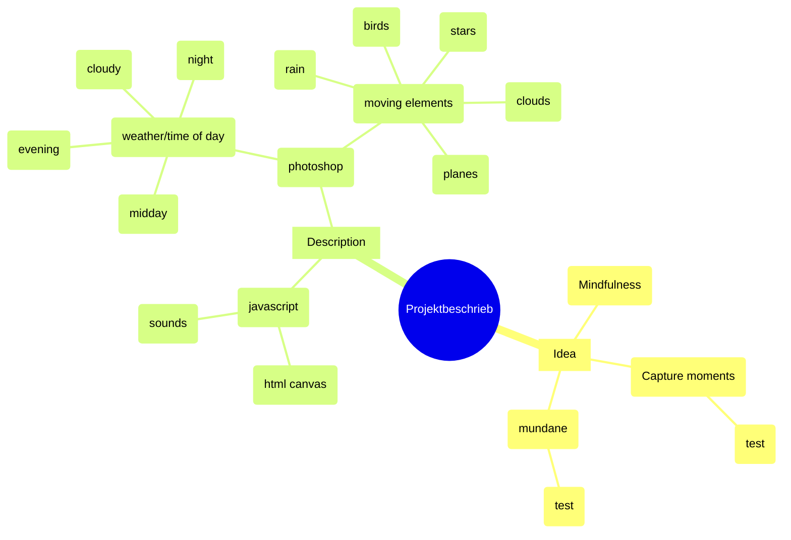

#### test

My idea for this project was to visualize my personal experiences with the concept of mindfulness.
Whenever i get stressed or overwhelmed, i remind myself to open my window and look outside, and focus on the beauty of the current moment with all its details.
This helps me to clear my head and get a break from my thoughts for a while, so i decided to digitally recreate these moments.
The project consists of four images of the cityscape outside my window, photographed over the span of a day. These images were edited in photoshop, where i also created 
additional elements such as clouds, raindrops, birds, a starry night sky and more, before i rendered it all on a HTML canvas. I used JavaScript to animate the elements, and underlayed them with ambient sounds that i recorded, to recreate the moments as faithfully as possible. The final result can be viewed in a browser, with the url:

-> 891 chars

___
#### V 1.5 (idea)

My idea for this project was to recreate moments of mindfulness, a topic that is very important in my daily life. 
When i feel stressed or overwhelmed, i often look out of my window and try to focus on the scenery, the details, the sounds, 

 

My idea for this project was to visualize my personal experiences with the concept of mindfulness.
Whenever i get stressed or overwhelmed, i remind myself to open my window and look outside, and focus on the beauty of the current moment with all its details.
This helps me to clear my head and get a break from my thoughts for a while, so i decided to digitally recreate these moments of mindfulness.

___

#### V 1.5 (specifics/technical details)

The project consists of four images of the cityscape outside my window, photographed over the span of a day. These images were edited in photoshop, where i also created 
additional elements such as clouds, raindrops, birds, a starry night sky and more, before i rendered it all on a HTML canvas. I used JavaScript to animate the elements, and underlayed them with ambient sounds that i recorded, to recreate the moments as faithfully as possible.

 

The project constists of four images of the cityscape opposite my house, that i took over the span of a day. 
These images were then edited and pixelated using Photoshop, and rendered on a html canvas. 

Afterwards i drew additional elements like birds, clouds and raindrops, to enhance the original images and add some movement and life. 
These elements were overlayed and animated using JavaScript and html. 
In addition, i recorded different ambient sounds to more accurately recreate these „momentary snapshots“. The end result can be viewed here:

___

#### V 1.5 (full)

My idea for this project was to recreate moments of mindfulness, a topic that 
is very important in my daily life. When i feel stressed or overwhelmed, i often look out of my window and try to focus on the scenery, the details, the sounds, and the whole picture, and i wanted to try and capture some of these moments.

The project constists of four images of the cityscape opposite my house, that i took over the span of a day. These images were then edited and pixelated using Photoshop, and rendered on a html canvas. 

Afterwards i drew additional elements like birds, clouds and raindrops, to 
enhance the original images and add some movement and life. These elements were overlayed and animated using JavaScript and html. In addition, i recorded different ambient sounds to more accurately recreate these „momentary 
snapshots“. The end result can be viewed here:

___